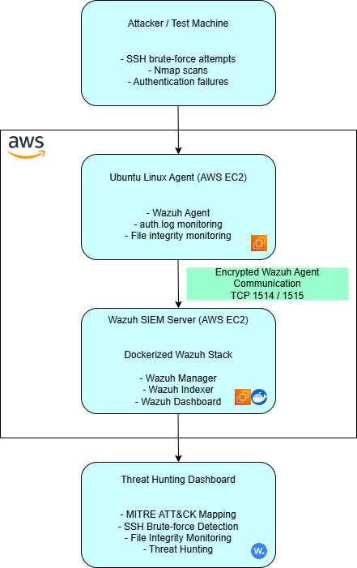

# CloudSec Linux SIEM Monitoring Lab

## Project Overview

CloudSec Linux SIEM Monitoring Lab is a cloud-based security monitoring environment built using Wazuh, Docker, Ubuntu, and AWS EC2. The platform centralizes Linux security logs, detects suspicious activity, monitors endpoints, and visualizes security events through a SIEM dashboard.

This project was designed to simulate a real-world Security Operations Center (SOC) environment capable of monitoring Linux systems, detecting attacks, and performing threat hunting.

---

## Features

- Centralized Linux log collection
- Dockerized Wazuh SIEM deployment
- Linux endpoint monitoring
- SSH authentication monitoring
- Threat hunting dashboard
- MITRE ATT&CK mapping
- File integrity monitoring
- Security event analysis
- AWS EC2 cloud deployment
- Real-time alerting

---

## Technologies Used

- Ubuntu Server 24.04
- Wazuh SIEM
- Docker & Docker Compose
- AWS EC2
- OpenSearch
- Linux System Administration
- Bash
- SSH
- MITRE ATT&CK Framework

---

## Architecture

---

## Simulated Security Events

The following attack simulations were performed inside the lab environment:

- SSH brute-force attempts
- Invalid SSH user logins
- Authentication failures
- File integrity monitoring events
- Unauthorized file modification
- Linux security event monitoring

---

## Skills Demonstrated

- Linux Administration
- SIEM Deployment
- Docker Containerization
- Endpoint Monitoring
- Threat Detection
- Threat Hunting
- Cloud Security
- AWS Infrastructure
- Security Monitoring
- Troubleshooting & Debugging

---

## Project Status

Current progress:

- [x] Wazuh SIEM deployment
- [x] Docker installation
- [x] Linux agent integration
- [x] SSH attack detection
- [x] Dashboard configuration
- [x] Custom admin password configuration
- [ ] File integrity monitoring demonstrations
- [ ] Architecture diagram
- [ ] Fail2Ban integration
- [ ] GeoIP visualization
- [ ] Additional endpoint integrations

---

## Future Improvements

- Fail2Ban integration
- Suricata IDS integration
- Slack/email alerting
- GeoIP attacker mapping
- Windows event log monitoring
- Active response automation
- Additional Linux agents
- Docker container monitoring

---

## Resume Relevance

This project demonstrates practical experience with:

- Linux system administration
- SIEM deployment and monitoring
- Dockerized infrastructure
- Cloud security operations
- Threat detection and analysis
- Security event monitoring
- Endpoint security
- AWS cloud infrastructure

